# Sales Pulse – Sales & Order Management

<table>
  <tr>
    <td>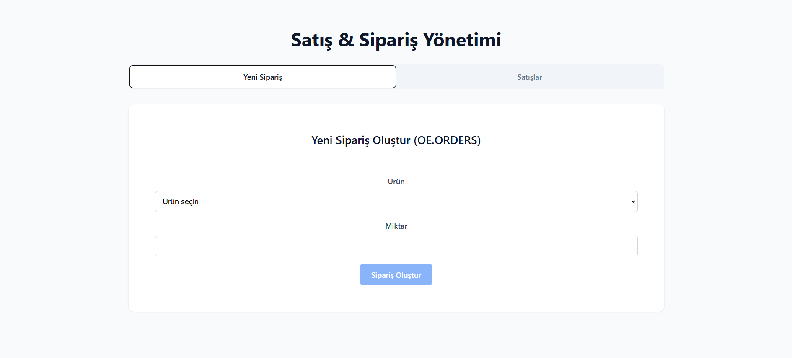</td>
  </tr>
      <tr>
    <td>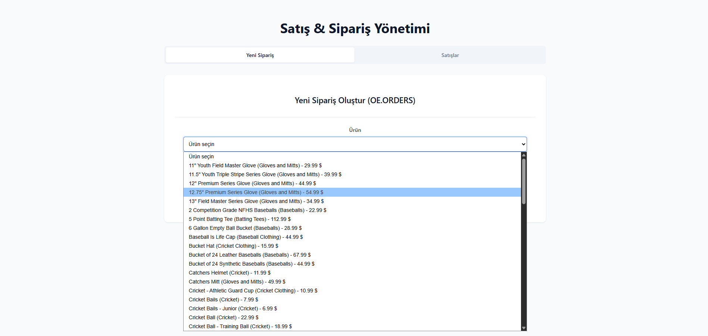</td>
  </tr>
    <tr>
    <td>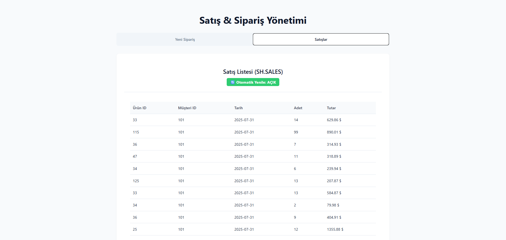</td>
  </tr>
     <tr>
    <td>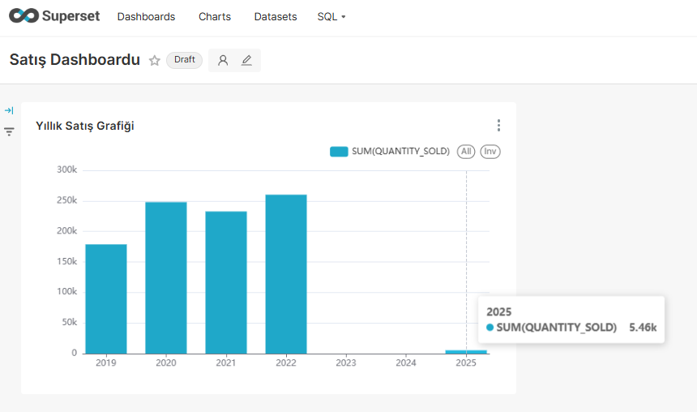</td>
  </tr>
</table>

A lightweight sales & order management system built on top of the Oracle OE sample schema, with:

- FastAPI backend (Python)

- React frontend (Vite + Axios)

- Oracle Database (OE.ORDERS + OE.ORDER_ITEMS + OE.PRODUCT_INFORMATION)

- Dockerized for easy deployment on any machine


---

## Features

### Product Management (`OE.PRODUCT_INFORMATION` + `PRODUCT_DESCRIPTIONS`)

- Fetch product list from `OE.PRODUCT_INFORMATION`
- Optional localized product names via `OE.PRODUCT_DESCRIPTIONS`
  - Language is controlled by `PRODUCT_LANG` env var or `?lang=` query parameter
- Display product name and list price in the UI

### Order Creation (`OE.ORDERS` + `OE.ORDER_ITEMS`)

- Create a new order in `OE.ORDERS`
- Automatically insert the corresponding line item into `OE.ORDER_ITEMS`
- Each order line contains:
  - `PRODUCT_ID`, `UNIT_PRICE`, `QUANTITY`, `LINE_ITEM_ID`
- Order summary is shown before submission on the frontend

### Orders Dashboard

- View the **latest 50 orders** (newest on top)
- Each order row shows:
  - Order ID, order date, customer id, status, total amount
  - A short **items preview** like: `Headphones x1; Cable x2 (+1 satır)`
  - **Items count** (number of `ORDER_ITEMS` lines)
- Click **Detay / Gizle** to expand an order and see a nested table with full line items:
  - Product name, unit price, quantity, line total
- Auto-refresh toggle (on/off) for the orders list (polling every 5s)

### Optimized Backend

- Oracle **connection pooling** with `oracledb`:
  - Pool created at app startup
  - Shared across all requests
- **Efficient queries**:
  - `/orders` endpoint fetches last 50 orders
  - Then loads all their items in a **single query** using a dynamic `IN` clause
- **Language-aware product names**:
  - `PRODUCT_LANG` env var for default language (e.g. `TR`, `US`)
  - `lang` query parameter overrides per-request if needed

### Easy Deployment with Docker Compose

- Frontend & backend run in containers
- Configurable via `.env.docker`
- Only dependency: an accessible Oracle database with the OE schema


---

## Tech Stack

### Backend:

- Python 3 + FastAPI

- `oracledb` (thin mode)

- Uvicorn (ASGI server)

- Connection pooling to Oracle

### Frontend:

- React (Vite)

- Axios for API calls

- Custom responsive CSS

### Database:

- Oracle 19c+
- OE sample schema:
  - `OE.PRODUCT_INFORMATION`
  - `OE.PRODUCT_DESCRIPTIONS` (for translations, optional)
  - `OE.ORDERS`
  - `OE.ORDER_ITEMS`

### Deployment:

- Docker & Docker Compose

- Environment-based configuration via `.env.docker`

---
## Project Structure

```bash
project-root/
│
├─ backend/           # FastAPI backend
│  ├─ main.py
│  ├─ requirements.txt
│  ├─ Dockerfile
│  └─ .dockerignore
│
├─ client/            # React frontend
│  ├─ src/App.jsx
│  ├─ Dockerfile
│  ├─ vite.config.js
│  └─ .dockerignore
│
├─ docker-compose.yml # Multi-container orchestration
├─ .env.docker        # Oracle DB connection config
└─ README.md          

```

---

## 🔁 Optional: Integrating OE Orders into SH.SALES (Data Warehouse)

The Sales Pulse app itself **only writes to OE.ORDERS and OE.ORDER_ITEMS**.

However, in many Oracle demo setups you may have a separate ETL/PL/SQL job or trigger that **copies OE orders into SH.SALES** for reporting (e.g., SH schema dashboards).

If you (or someone else) implement such a process, you must ensure:

1. **SH.TIMES covers the dates you insert**
   - SH.SALES is partitioned by `TIME_ID`.
   - Any `TIME_ID` you use in SH.SALES must exist in SH.TIMES.
   - Otherwise, inserts may fail or partitions may not match.

2. **SH.SALES has partitions for those dates**
   - If you insert data for years not covered by existing partitions, you will hit:

   ```bash
   ORA-14400: inserted partition key does not map to any partition
    ```

### Adding dates to SH.TIMES (example for year 2025)

You can generate one row per day for 2025 with a PL/SQL block like this (adapt the year as needed):

```sql
BEGIN
  FOR v_date IN 0 .. 364 LOOP
    DECLARE
      d DATE := TO_DATE('01-01-2025', 'DD-MM-YYYY') + v_date;
    BEGIN
      INSERT INTO SH.TIMES (
        TIME_ID, DAY_NAME, DAY_NUMBER_IN_WEEK, DAY_NUMBER_IN_MONTH,
        CALENDAR_WEEK_NUMBER, FISCAL_WEEK_NUMBER, WEEK_ENDING_DAY, WEEK_ENDING_DAY_ID,
        CALENDAR_MONTH_NUMBER, FISCAL_MONTH_NUMBER, CALENDAR_MONTH_DESC, CALENDAR_MONTH_ID,
        FISCAL_MONTH_DESC, FISCAL_MONTH_ID, DAYS_IN_CAL_MONTH, DAYS_IN_FIS_MONTH,
        END_OF_CAL_MONTH, END_OF_FIS_MONTH, CALENDAR_MONTH_NAME, FISCAL_MONTH_NAME,
        CALENDAR_QUARTER_DESC, CALENDAR_QUARTER_ID, FISCAL_QUARTER_DESC, FISCAL_QUARTER_ID,
        DAYS_IN_CAL_QUARTER, DAYS_IN_FIS_QUARTER, END_OF_CAL_QUARTER, END_OF_FIS_QUARTER,
        CALENDAR_QUARTER_NUMBER, FISCAL_QUARTER_NUMBER, CALENDAR_YEAR, CALENDAR_YEAR_ID,
        FISCAL_YEAR, FISCAL_YEAR_ID, DAYS_IN_CAL_YEAR, DAYS_IN_FIS_YEAR,
        END_OF_CAL_YEAR, END_OF_FIS_YEAR
      )
      VALUES (
        d,
        TO_CHAR(d, 'Day'),
        TO_NUMBER(TO_CHAR(d, 'D')),
        TO_NUMBER(TO_CHAR(d, 'DD')),
        TO_NUMBER(TO_CHAR(d, 'WW')),
        TO_NUMBER(TO_CHAR(d, 'WW')),
        NEXT_DAY(d, 'SATURDAY'),
        TO_NUMBER(TO_CHAR(NEXT_DAY(d, 'SATURDAY'), 'DDD')),
        TO_NUMBER(TO_CHAR(d, 'MM')),
        TO_NUMBER(TO_CHAR(d, 'MM')),
        TO_CHAR(d, 'Mon'),
        TO_NUMBER(TO_CHAR(d, 'MM')),
        TO_CHAR(d, 'Mon'),
        TO_NUMBER(TO_CHAR(d, 'MM')),
        TO_NUMBER(TO_CHAR(LAST_DAY(d), 'DD')),
        TO_NUMBER(TO_CHAR(LAST_DAY(d), 'DD')),
        LAST_DAY(d),
        LAST_DAY(d),
        TO_CHAR(d, 'Month'),
        TO_CHAR(d, 'Month'),
        'Q' || TO_CHAR(d, 'Q'),
        TO_NUMBER(TO_CHAR(d, 'Q')),
        'Q' || TO_CHAR(d, 'Q'),
        TO_NUMBER(TO_CHAR(d, 'Q')),
        90, 90,
        ADD_MONTHS(TRUNC(d, 'Q'), 3) - 1,
        ADD_MONTHS(TRUNC(d, 'Q'), 3) - 1,
        TO_NUMBER(TO_CHAR(d, 'Q')),
        TO_NUMBER(TO_CHAR(d, 'Q')),
        2025,
        2025,
        2025,
        2025,
        365, 365,
        TO_DATE('31-12-2025', 'DD-MM-YYYY'),
        TO_DATE('31-12-2025', 'DD-MM-YYYY')
      );
    END;
  END LOOP;
  COMMIT;
END;
```

How does it work?

- Inserts one row for each day of 2025 (01-01-2025 → 31-12-2025).

- Sets logical values for all required columns:

- Day, month, and quarter information are calculated automatically.

- WEEK_ENDING_DAY = Saturday

- DAYS_IN_CAL_YEAR = 365

- Quarter and month names are calculated with TO_CHAR().


<table>
  <tr>
    <td>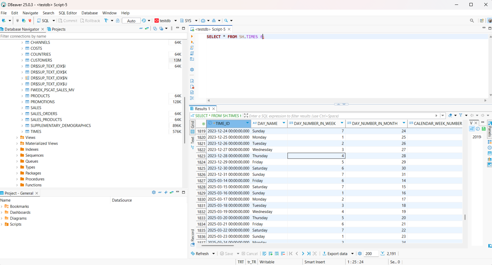</td>
  </tr>
</table>

Adding new partitions. (Adding a “catch-all” future partition to SH.SALES)
- If you do not want to manage yearly partitions manually, you can add a MAXVALUE partition so that all future dates are accepted:
- Opening partitions means updating the SH.SALES table to accept new dates. This is because the SH.SALES table is a partitioned table and only accepts data for specific dates via the TIME_ID column.
- If a maxvalue partition (infinite date) is added to the table, we don't have to bother with it again:

```bash
ALTER TABLE SH.SALES
ADD PARTITION SALES_FUTURE VALUES LESS THAN (MAXVALUE)
TABLESPACE USERS;
```
This allows TIME_ID values for 2026, 2030, 2050, etc. without further partition changes.

<table>
  <tr>
    <td>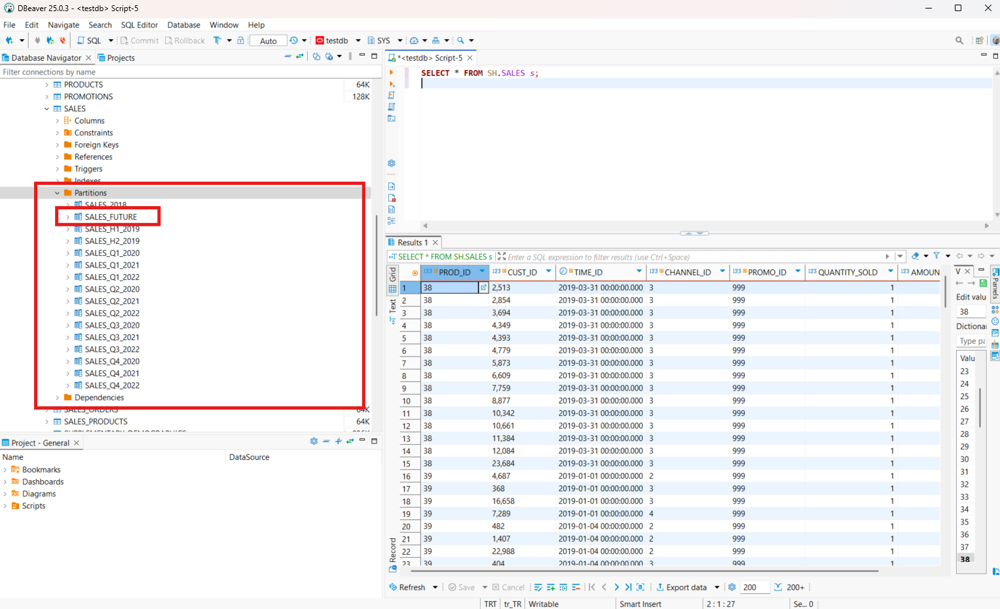</td>
  </tr>
</table>


--- 
## Environment & Oracle Configuration

The backend reads the following environment variables:

```bash
ORACLE_DSN=192.168.1.182:1521/testdb
ORACLE_USER=superset
ORACLE_PASSWORD=superset123

# Optional: default language for PRODUCT_DESCRIPTIONS.LANGUAGE_ID
PRODUCT_LANG=TR
```
- `PRODUCT_LANG` controls which language row is used in `OE.PRODUCT_DESCRIPTIONS`.
- You can also override it per request using `?lang=TR` or `?lang=US` on the endpoints  
  (e.g. `/products?lang=TR`, `/orders?lang=US`).


---

## Prerequisites – How to Get the App Working

For the application to work end-to-end, follow these required setup steps in order:

### 1 Oracle Database Setup

- You need an Oracle DB instance running with the **OE sample schema**.
- If not available, install Oracle 19c+ and load the sample schemas (including **OE**).
- Ensure the following tables exist and are accessible:
  - `OE.PRODUCT_INFORMATION`
  - `OE.PRODUCT_DESCRIPTIONS` (optional but recommended for translated names)
  - `OE.ORDERS`
  - `OE.ORDER_ITEMS`

### 2 Verify Oracle Network Access

Oracle should be accessible via IP & port, e.g.:

```bash
DSN = 192.168.1.182:1521/testdb
```

The user you connect with (e.g. `superset`) must have:

- `SELECT` on the tables listed above
- `INSERT` on `OE.ORDERS` and `OE.ORDER_ITEMS`

### 3 Configure Environment (`.env.docker`)

Create `.env.docker` in the project root and set your own values:

```bash
# .env.docker
ORACLE_DSN=YOUR_IP:1521/YOURDB
ORACLE_USER=YOUR_USER
ORACLE_PASSWORD=YOUR_PASSWORD

# Default language for OE.PRODUCT_DESCRIPTIONS (e.g. TR, US)
PRODUCT_LANG=TR
```
Tip: You can test the connection with a basic Oracle client like SQL Developer or `sqlplus`.

### 4 Start Oracle (If Needed)

If you’re using a local Oracle VM or container, ensure it’s running before launching the app.

---

## Running with Docker Compose (Docker Desktop)

### 1 Clone the repository

```bash
git clone https://github.com/yourusername/sales-pulse.git
cd sales-pulse
```

### 2 Create and configure `.env.docker`

```bash
ORACLE_DSN=YOUR_IP:1521/YOURDB
ORACLE_USER=YOUR_USER
ORACLE_PASSWORD=YOUR_PASSWORD
PRODUCT_LANG=TR
```

### 3 Build & run with Docker Compose

```bash
docker-compose up --build
```

This will:

- Start the FastAPI backend (port **8000** inside the container, or mapped port such as **8001**)
- Start the React frontend (port **5173**)
- Connect both to Oracle and serve the app

Typical local ports:

- Backend → `http://localhost:8000` (or `http://localhost:8001` depending on your compose mapping)
- Frontend → `http://localhost:5173` (or mapped port)

After the first build:

```bash
# Rebuild only if you changed code
docker compose build client
docker compose build server
docker compose up -d
```

> `docker compose build client`: rebuilds the React frontend  
> `docker compose build server`: rebuilds the FastAPI backend  
> Tip: `docker compose up --build -d` will also rebuild what’s needed automatically.

### 4️ Stop containers
```bash
docker-compose down
```

---

## How It Works

1. **Frontend (React)**
   - Calls backend APIs using `VITE_API_URL` (configured in `.env` / environment).
   - Provides two main tabs:
     - Yeni Sipariş – create a new order
     - Siparişler – view the latest 50 orders
   - Shows:
     - Product dropdown with translated names (if available) and prices
     - Quantity input
     - Live order summary (product name, unit price, total)
     - Auto-refreshing orders table with “Detay” / “Gizle” to see line items

2. **Backend (FastAPI)**
   - Connects to Oracle using a connection pool (`oracledb.create_pool`).
   - Exposes endpoints:
     - `GET /ping` → health check
     - `GET /products?lang=...` → products from `OE.PRODUCT_INFORMATION`
       joined with `OE.PRODUCT_DESCRIPTIONS` (optional translation)
     - `GET /orders?lang=...` → last 50 rows from `OE.ORDERS`
       plus `items_count` & `items_preview` for each order
     - `GET /order-items?order_id=...&lang=...` → details from `OE.ORDER_ITEMS`
       joined with product names
     - `POST /add-order` → inserts into:
       - `OE.ORDERS` (order header)
       - `OE.ORDER_ITEMS` (single line item with price * quantity)
   - Uses `PRODUCT_LANG` env var as default language; `lang` query parameter overrides per request.

3. **Database (Oracle)**
   - Uses the OE sample schema as the main source of truth:
     - `OE.PRODUCT_INFORMATION` – base product data and list prices
     - `OE.PRODUCT_DESCRIPTIONS` – translated product names (per `LANGUAGE_ID`)
     - `OE.ORDERS` – order headers
     - `OE.ORDER_ITEMS` – order line items
   - No direct dependency on `SH.SALES` / `SH.TIMES` in the core app.
   - Optionally, you can build additional ETL/PL/SQL jobs to push OE orders into `SH.SALES`
     for data warehouse/reporting scenarios.

---

## Superset Previews

In the superset, we select our Oracle database, OE schema, and ORDERS table and create a chart. Here, we examine the number of sales by year.

<table>
  <tr>
    <td>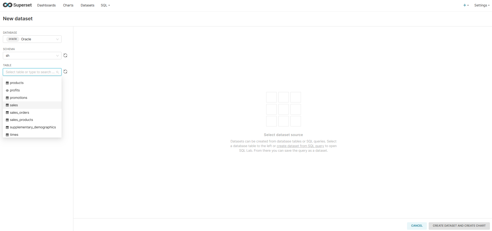</td>
    <td>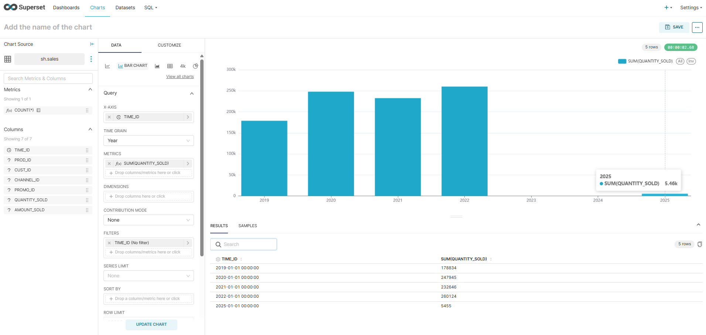</td>
  </tr>
</table>


Next, we set the update interval for our chart. In the example, we chose 1 minute. By updating the chart every minute, we can monitor the latest sales numbers.

<table>
  <tr>
    <td>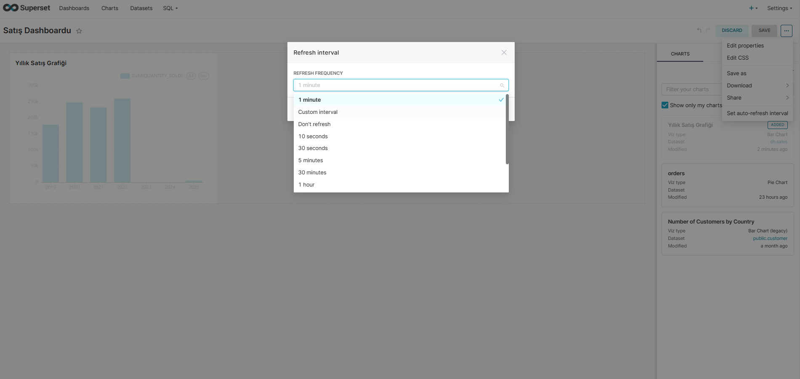</td>
     <td>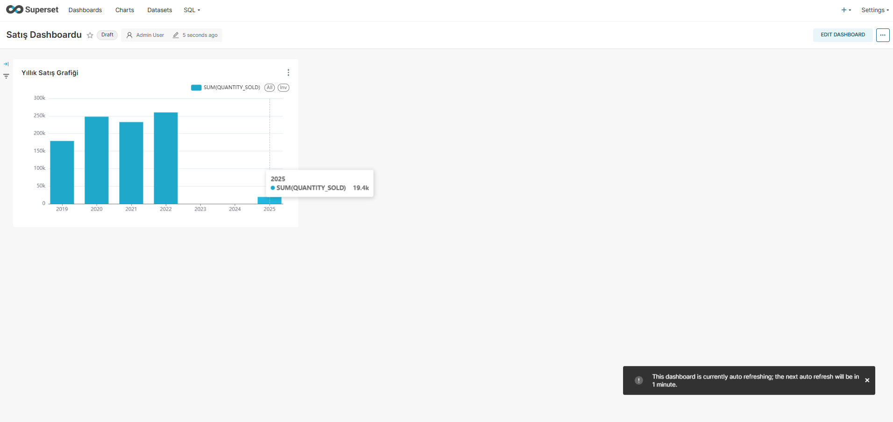</td>
  </tr>
</table>

As can be seen, while the total number of sales in 2025 was 5.46 thousand, the table was updated to show us that new sales were made, and the number of sales in 2025 increased to 19.4 thousand.

<table>
  <tr>
    <td></td>
    <td>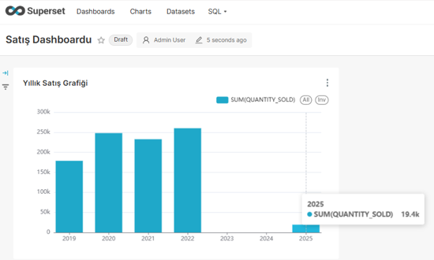</td>
  </tr>
</table>


