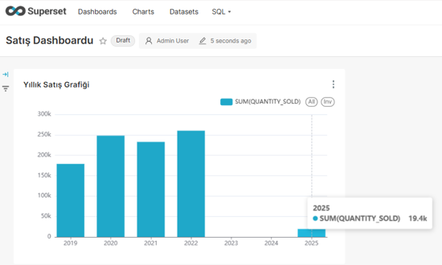

# Sales Pulse – Sales & Order Management

<table>
  <tr>
    <td></td>
  </tr>
      <tr>
    <td></td>
  </tr>
    <tr>
    <td></td>
  </tr>
     <tr>
    <td></td>
  </tr>
</table>

A lightweight sales & order management system with:

- FastAPI backend (Python)

- React frontend (Vite + Axios)

- Oracle Database for storing products, orders, and sales

- Dockerized for easy deployment on any machine


---

## Features

### Product Management
- Fetch product list from SH.PRODUCTS table
- 
- Display price, description, and subcategory

### Order Creation

- Create a new order in OE.ORDERS

- Automatically insert sales record into SH.SALES

- Order summary shown before submission

### Sales Dashboard

- View last 50 sales (newest on top)

- Auto-refresh toggle (on/off)

### Optimized Backend

- Oracle connection pooling for better performance

- Partition-safe inserts using latest TIME_ID from SH.TIMES

### Easy Deployment with Docker Compose

- Frontend & backend run in containers

- Configurable via .env.docker

---

## Tech Stack

### Backend:

- Python 3 + FastAPI

- oracledb (thin mode)

- Uvicorn server

- Connection pooling to Oracle

### Frontend:

- React (Vite)

- Axios for API calls

- Responsive CSS (custom)

### Database:

- Oracle 19c+ (Sample Schemas: SH and OE)

### Deployment:

- Docker & Docker Compose

- Environment-based configuration (.env.docker)

---
## Project Structure

```bash
project-root/
│
├─ backend/           # FastAPI backend
│  ├─ main.py
│  ├─ requirements.txt
│  ├─ Dockerfile
│  └─ .dockerignore
│
├─ client/            # React frontend
│  ├─ src/App.jsx
│  ├─ Dockerfile
│  ├─ vite.config.js
│  └─ .dockerignore
│
├─ docker-compose.yml # Multi-container orchestration
├─ .env.docker        # Oracle DB connection config
└─ README.md          

```

---

## ⚠️ Important Notes on Oracle Data Requirements

To ensure the application works properly, make sure of the following:

- The SH.TIMES table must include dates for the year 2025 and beyond. Otherwise, inserting sales data tied to the current date will fail.

- The SH.SALES table is partitioned by TIME_ID. You must add new partitions (e.g., for 2023–2025) if they don’t already exist, or you'll encounter the following error during inserts:

```bash
ORA-14400: inserted partition key does not map to any partition
```
If you're unsure, ask your DBA to ensure the necessary partitions are created
or insert sample data with TIME_ID values that fall within existing partitions.


The script adds the year 2025 to the TIMES Table. You can edit and use it for other years.

```bash
BEGIN
  FOR v_date IN 0 .. 364 LOOP
    DECLARE
      d DATE := TO_DATE('01-01-2025', 'DD-MM-YYYY') + v_date;
    BEGIN
      INSERT INTO SH.TIMES (
        TIME_ID, DAY_NAME, DAY_NUMBER_IN_WEEK, DAY_NUMBER_IN_MONTH,
        CALENDAR_WEEK_NUMBER, FISCAL_WEEK_NUMBER, WEEK_ENDING_DAY, WEEK_ENDING_DAY_ID,
        CALENDAR_MONTH_NUMBER, FISCAL_MONTH_NUMBER, CALENDAR_MONTH_DESC, CALENDAR_MONTH_ID,
        FISCAL_MONTH_DESC, FISCAL_MONTH_ID, DAYS_IN_CAL_MONTH, DAYS_IN_FIS_MONTH,
        END_OF_CAL_MONTH, END_OF_FIS_MONTH, CALENDAR_MONTH_NAME, FISCAL_MONTH_NAME,
        CALENDAR_QUARTER_DESC, CALENDAR_QUARTER_ID, FISCAL_QUARTER_DESC, FISCAL_QUARTER_ID,
        DAYS_IN_CAL_QUARTER, DAYS_IN_FIS_QUARTER, END_OF_CAL_QUARTER, END_OF_FIS_QUARTER,
        CALENDAR_QUARTER_NUMBER, FISCAL_QUARTER_NUMBER, CALENDAR_YEAR, CALENDAR_YEAR_ID,
        FISCAL_YEAR, FISCAL_YEAR_ID, DAYS_IN_CAL_YEAR, DAYS_IN_FIS_YEAR,
        END_OF_CAL_YEAR, END_OF_FIS_YEAR
      )
      VALUES (
        d,
        TO_CHAR(d, 'Day'),
        TO_NUMBER(TO_CHAR(d, 'D')),
        TO_NUMBER(TO_CHAR(d, 'DD')),
        TO_NUMBER(TO_CHAR(d, 'WW')),
        TO_NUMBER(TO_CHAR(d, 'WW')),
        NEXT_DAY(d, 'SATURDAY'),
        TO_NUMBER(TO_CHAR(NEXT_DAY(d, 'SATURDAY'), 'DDD')),
        TO_NUMBER(TO_CHAR(d, 'MM')),
        TO_NUMBER(TO_CHAR(d, 'MM')),
        TO_CHAR(d, 'Mon'),
        TO_NUMBER(TO_CHAR(d, 'MM')),
        TO_CHAR(d, 'Mon'),
        TO_NUMBER(TO_CHAR(d, 'MM')),
        TO_NUMBER(TO_CHAR(LAST_DAY(d), 'DD')),
        TO_NUMBER(TO_CHAR(LAST_DAY(d), 'DD')),
        LAST_DAY(d),
        LAST_DAY(d),
        TO_CHAR(d, 'Month'),
        TO_CHAR(d, 'Month'),
        'Q' || TO_CHAR(d, 'Q'),
        TO_NUMBER(TO_CHAR(d, 'Q')),
        'Q' || TO_CHAR(d, 'Q'),
        TO_NUMBER(TO_CHAR(d, 'Q')),
        90, 90,
        ADD_MONTHS(TRUNC(d, 'Q'), 3) - 1,
        ADD_MONTHS(TRUNC(d, 'Q'), 3) - 1,
        TO_NUMBER(TO_CHAR(d, 'Q')),
        TO_NUMBER(TO_CHAR(d, 'Q')),
        2025,
        2025,
        2025,
        2025,
        365, 365,
        TO_DATE('31-12-2025', 'DD-MM-YYYY'),
        TO_DATE('31-12-2025', 'DD-MM-YYYY')
      );
    END;
  END LOOP;
  COMMIT;
END;
```
How does it work?

- Inserts one row for each day of 2025 (01-01-2025 → 31-12-2025).

- Sets logical values for all required columns:

- Day, month, and quarter information are calculated automatically.

- WEEK_ENDING_DAY = Saturday

- DAYS_IN_CAL_YEAR = 365

- Quarter and month names are calculated with TO_CHAR().


<table>
  <tr>
    <td></td>
  </tr>
</table>

Adding new partitions.

- Opening partitions means updating the SH.SALES table to accept new dates. This is because the SH.SALES table is a partitioned table and only accepts data for specific dates via the TIME_ID column.

- If a maxvalue partition (infinite date) is added to the table, we don't have to bother with it again:

```bash
ALTER TABLE SH.SALES
ADD PARTITION SALES_FUTURE VALUES LESS THAN (MAXVALUE)
TABLESPACE USERS;
```
This accepts all future dates 2026, 2030, 2050...

<table>
  <tr>
    <td></td>
  </tr>
</table>


--- 

## Prerequisites – How to Get the App Working

For the application to work end-to-end, follow these required setup steps in order:

### 1️ Oracle Database Setup

- You need an Oracle DB instance running with the SH and OE sample schemas.

- If not available, install Oracle 19c+ and load the sample schemas.

- Ensure the following tables exist and are accessible:

    - SH.PRODUCTS

    - SH.SALES

    - SH.TIMES

    - OE.ORDERS

### 2 Verify Oracle Network Access

Oracle should be accessible via IP & port, e.g.:

```bash
DSN = 192.168.1.182:1521/testdb
```
The user you connect with (e.g. superset) must have SELECT and INSERT permissions on these schemas.


### 3️ Configure Environment (.env.docker) (Environment Variables)

Update the following file with your Oracle credentials: (Your Virtual Machine ip / oracledb name, the oracle user you registered in the superset)

```bash
# .env.docker
ORACLE_DSN=192.168.1.182:1521/testdb
ORACLE_USER=superset
ORACLE_PASSWORD=superset123
```
Tip: You can test connection with a basic Oracle client like SQL Developer or sqlplus.

### 4️ Start Oracle (If Needed)

If you're using a local Oracle VM or container, ensure it’s running before launching the app.

### 5️ Run the App (Docker Compose)

Once Oracle is reachable and .env.docker is updated:

```bash
docker-compose up --build
```

This will:

- Start the FastAPI backend (port 8001)

- Start the React frontend (port 5173)

- Connect to Oracle and serve the app


---

## Running Locally with Docker Compose (Docker Desktop)

### 1️ Clone the repository

```bash
git clone https://github.com/yourusername/sales-pulse.git
cd sales-pulse
```

### 2️ Create and configure .env.docker

```bash
ORACLE_DSN=YOUR_IP:1521/YOURDB
ORACLE_USER=YOUR_USER
ORACLE_PASSWORD=YOUR_PASSWORD
```

### 3️ Build & run with Docker Compose

```bash
docker-compose up --build
```

- Backend → http://localhost:8001

- Frontend → http://localhost:5173 (or mapped port)

### 4️ Stop containers

```bash
docker-compose down
```

## Manual Local Development

If not using Docker:

### Backend:

```bash
cd backend
python -m venv venv
source venv/Scripts/activate  # Windows: venv\Scripts\activate
pip install -r requirements.txt
uvicorn main:app --reload --port 8001
```

### Frontend:

```bash
cd client
npm install
npm run dev
```

--- 

## How It Works

1. Frontend (React):

- Calls backend APIs from VITE_API_URL (configured in .env)

- Displays sales list, product dropdown, and order form

2. Backend (FastAPI):

- Connects to Oracle using connection pool

- Inserts into:

  - OE.ORDERS (order header)

  - SH.SALES (sales record)

- Fetches product list and latest 50 sales

3. Database (Oracle):

- Uses existing sample schemas OE and SH

- SH.TIMES ensures partition-safe inserts

---

## Superset Previews

In the superset, we select our Oracle database, SH schema, and SALES table and create a chart. Here, we examine the number of sales by year.

<table>
  <tr>
    <td></td>
    <td></td>
  </tr>
</table>


Next, we set the update interval for our chart. In the example, we chose 1 minute. By updating the chart every minute, we can monitor the latest sales numbers.

<table>
  <tr>
    <td></td>
     <td></td>
  </tr>
</table>

As can be seen, while the total number of sales in 2025 was 5.46 thousand, the table was updated to show us that new sales were made, and the number of sales in 2025 increased to 19.4 thousand.

<table>
  <tr>
    <td></td>
    <td></td>
  </tr>
</table>


